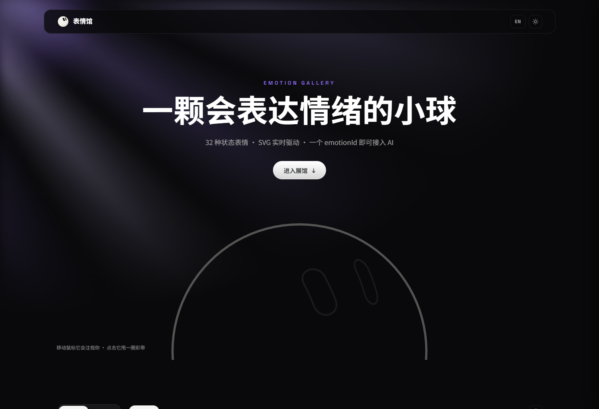
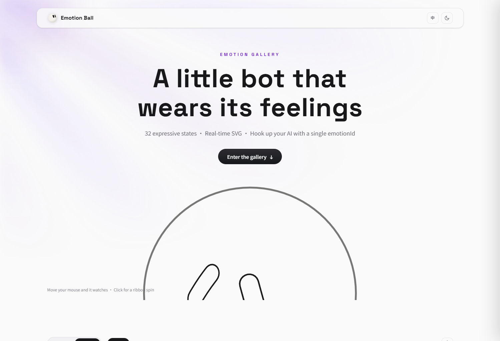
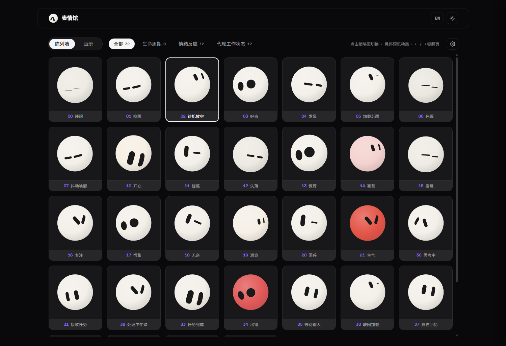
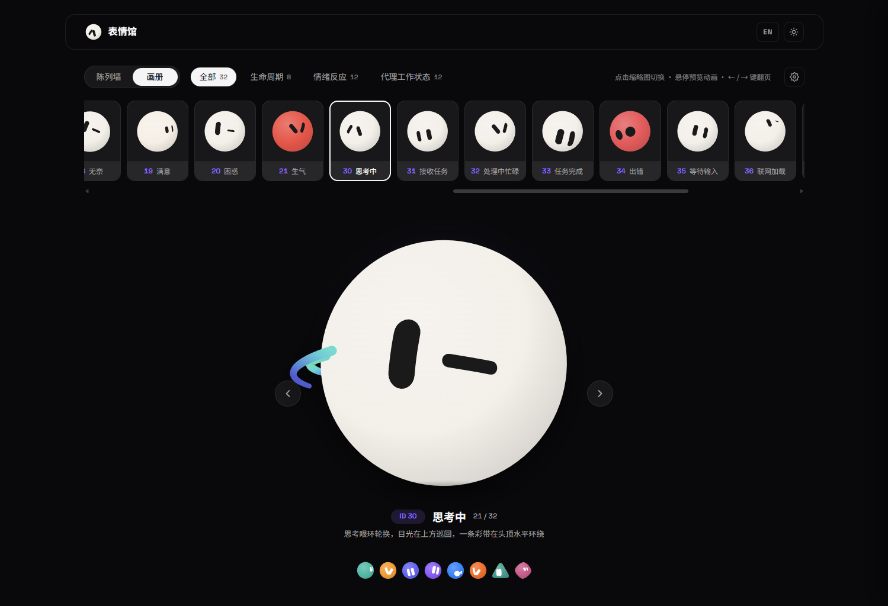

<div align="center">

# Emotion Ball Gallery

**An expression engine for AI assistants — 32 emotion states · 3 body shapes · pure SVG + vanilla JavaScript · zero dependencies**

[](https://emotion-balls.vercel.app/)
[](LICENSE)
[](#)
[](#)

[中文](README.md) | **English**

[Live demo](https://emotion-balls.vercel.app/) · [Features](#features) · [Quick start](#quick-start) · [Integration guide](#integration-guide) · [Customization](#customization--extensibility) · [License](#license)

</div>

---

Emotion Ball is an expression engine for AI assistants: 32 emotion states rendered entirely in pure SVG and vanilla JavaScript — no frameworks, no image assets. Your AI only needs to output a single `emotionId` and the ball switches to the matching expression, making it a drop-in emotion layer for chatbots, desktop pets and floating assistants.

It is also more than "a ball": three body shapes ship out of the box — blob, wedge and gem — along with themed multi-instance support and a wireframe mode. The whole expression system is pure-data driven: eye-ring pools, animation primitives and keyframe sequences compose freely, so you can build new expressions and behaviors on top of the existing design without touching engine code.

The repository also ships with a complete gallery site: a wireframe hero opening, wall and album browsing modes, a bilingual UI and dark / light themes.

## Preview

| Hero (dark) | Light theme · English |
| :---: | :---: |
|  |  |

| Wall mode | Stage lightbox |
| :---: | :---: |
|  |  |



## Features

- **32 emotion states** across three groups — Lifecycle (sleeping / waking / idle…), Emotions (happy / shy / angry / surprised…) and Agent States (thinking / searching / error / done…) — all config-driven
- **3 body shapes**: blob, wedge and gem, with one eye and animation system that adapts automatically to each silhouette; themed instances (team bots) and wireframe mode are also supported
- **Segmented emotionId scheme**: the tens digit is the group prefix — `00-09` Lifecycle, `10-29` Emotions, `30-49` Agent States, `50+` Custom; gaps between groups are reserved slots and existing IDs are never renumbered, so integrations can hard-code them safely
- **Contour-ring eye system**: 25 sets of 48-point eye contours, point-by-point spring morphing, expression-pool rotation and overshooting blink keyframes
- **Spherical projection**: eyes follow the body silhouette with longitude mapping and cosine compression, hiding automatically when spun to the back
- **Ribbons & confetti**: spin-triggered 3D orbital ribbon trails with 5-stop hue gradients, a persistent halo ribbon for the thinking state, and physics-based confetti bursts
- **Mouse gaze**: page-wide gaze tracking with frame-rate-independent smoothing, plus constant subtle eye wander
- **Config-driven and extensible**: every expression is a pure-data composition of eye-ring pool + animation primitives + keyframe sequence; register custom expressions at runtime and import / export the full config — see [Customization](#customization--extensibility)
- **Robust AI protocol**: `handleAIMessage` accepts an object or a JSON string; unknown IDs, parse failures and missing fields all fall back to idle and emit an `error` event — it never breaks the page
- **Zero dependencies**: HTML + SVG + vanilla JS with no build step, ready to drop into an Electron floating window
- **Gallery site**: wall mode (grid + click-to-open lightbox) and album mode (horizontal strip + big stage with paging), settings drawer, auto tour, Chinese / English, dark / light themes, all preferences persisted in localStorage

## Quick start

```bash
# any static server works, e.g.:
python -m http.server 8765
# open http://localhost:8765/
```

Or just open `index.html` directly (a local server is recommended so Google Fonts load).

## Integration guide

### Minimal setup

Load four scripts in order (no build, no dependencies) and create an instance. `js/i18n.js` and `js/app.js` belong to the gallery site and are not needed by hosts:

```html
<script src="js/rings.js"></script>
<script src="js/emotions.js"></script>
<script src="js/ball.js"></script>
<script src="js/engine.js"></script>

<div id="bot" style="width:200px;height:200px"></div>
<script>
  var ball = EmotionBall.create(document.getElementById('bot'), {
    emotion: '02', idle: true
  });
</script>
```

### AI protocol

Your AI outputs a single JSON payload and hands it to `handleAIMessage` (object or string):

```js
ball.handleAIMessage('{"emotionId":"30","tips":"thinking about the question"}');
```

- Unknown `emotionId`, JSON parse failures and missing fields emit an `error` event and fall back to idle (`fallbackId`, default `'02'`);
- `tips` is optional display text, surfaced through the `tips` event for the host to render as it sees fit.

### Creation options

| Option | Default | Description |
| --- | --- | --- |
| `emotion` | `'02'` | initial emotion ID |
| `shape` | `'blob'` | body shape: `blob` / `wedge` / `gem` |
| `color` / `eyeColor` | — | themed instance body / eye color, overriding per-emotion colors |
| `eyeScale` | `1` | eye magnification; `1.5–1.8` recommended below 80 px for readability |
| `idle` | `false` | idle policy — auto standby / sleep after a timeout; pass an object to customize durations and target states |
| `autostart` | `true` | `false` renders a single static frame without entering the animation loop (for thumbnails) |
| `lite` | follows `autostart` | lite mode: disables ribbon / confetti effects |
| `fallbackId` | `'02'` | fallback emotion for unknown IDs |

### Events & methods

```js
ball.on('change', e => {});         // emotion switched { id, def, auto }
ball.on('tips',   e => {});         // AI display text { text }
ball.on('error',  e => {});         // protocol error { message, ... }

ball.setEmotion('21');              // switch directly
ball.setGaze(nx, ny);               // normalized gaze [-1, 1]; host listens to pointermove
ball.setStyle({ sketch: 1 });       // wireframe mode
ball.spin(3);                       // spin & throw ribbons
ball.burst(24);                     // confetti
ball.bounce();                      // bounce
ball.startTour(ids, 2500);          // auto tour / ball.stopTour()
ball.setActive(false);              // pause off-screen to save power; true resumes
ball.renderStatic();                // render one static frame while paused
ball.registerEmotion(raw);          // register a custom emotion at runtime
ball.destroy();                     // dispose the instance
```

### Multi-instance & performance

- All instances share a single rAF heartbeat, so the instance count does not multiply loop overhead;
- Thumbnail walls: render statically with `autostart: false`, then `setActive(true)` on hover and `setActive(false)` on leave;
- Pair with IntersectionObserver to pause off-screen instances via `setActive(false)`.

### Desktop pet / Electron

- Window flags: `transparent: true, frame: false, alwaysOnTop: true, skipTaskbar: true`, with a transparent page background and only the ball container;
- Click-through: `win.setIgnoreMouseEvents(true, { forwardMouseMove: true })` — the ball still receives `setGaze` while clicks pass through;
- Forward AI messages via IPC: `ipcRenderer.on('emotion', (_, msg) => ball.handleAIMessage(msg))`;
- For small floating windows (≤ 120 px), use `eyeScale: 1.5` with `lite: true`.

## Customization & extensibility

The engine and render layers are a stable foundation — new expressions and behaviors are built from pure-data configs on top of the existing design, without touching engine code.

### Emotion config format

```js
{
  id: '50', name: 'Custom', group: 'custom',
  desc: '中文描述', en: { name: 'Custom', desc: '...' },
  transition: 380,            // entry transition duration (ms)
  gaze: true,                 // false = ignore mouse gaze (sleep / halt states)
  pool: [2, 11, 17, 19],      // eye-ring pool, rotated randomly within poolMs
  poolMs: [2500, 4500],       // rotation interval; poolSpeed controls morph speed
  blinkMs: [2500, 5000],      // blink interval (null = never)
  openness: 1,                // resting eye openness (tired 0.55, sleeping 0.08)
  antics: true,               // random idle antics (spin / bounce)
  body: { breathe: 0.014, color: '#F6EFE4', zzz: 0, orbit: 0 },
  anims: [ { target: 'eyes', prop: 'lookY', type: 'glance', amp: 6, period: 3000 } ],
  sequence: { ... }           // optional entry keyframe sequence
}
```

### Animation primitives

Each expression layers up to three animators, composed from six primitives:

| Type | Effect | Key parameters |
| --- | --- | --- |
| `sine` | sine drift / breathing / sweeping | `amp, period, phase` |
| `glance` | smoothed square wave, dwelling at both ends (look left, look right) | `amp, period` |
| `pulse` | rhythmic 0 → amp scaling | `amp, period` |
| `jitter` | pseudo-noise shake with optional decay | `amp, speed, decay` |
| `scan` | fast triangular sweep (searching / scanning) | `amp, period` |
| `blink` | periodic closing (auto-desynced across instances) | `interval, dur, phaseMs` |

`target`: `eyes / body / left / right`; `prop`: `lookX / lookY / x / y / scale / open / rotate`.

### Keyframe sequences

A `sequence` defines a one-shot performance played on entering an expression, then settles per its `settle` semantics: `'base'` eases back to the resting pose (surprise), `'hold'` freezes on the last frame (blushing pink, angry red), and `{ next: '02' }` chains into another expression (wake up → idle).

### Registration and import / export

```js
// register a new expression at runtime (IDs 50+ are the custom range, fully validated)
EmotionBall.config.register({ id: '50', name: 'Custom', group: 'custom', ... });

// export / import the full config as JSON
// (the gallery's settings drawer offers the same buttons)
EmotionBall.config.exportConfig();
EmotionBall.config.importConfig(json);
```

### AI collaboration skills

`.cursor/skills/` ships two engineering guides that AI editors such as Cursor pick up automatically when this repository is open:

- **emotion-design** — the expression design spec: eye-ring pool reference, animation parameter ranges, keyframe semantics and bilingual copy requirements, so an AI designs new expressions within a consistent visual language;
- **emotion-integration** — integration practices: SDK options, the AI protocol, multi-instance performance and Electron guidance, so an AI can wire the ball into your host app.

## Project layout

```
emotion-ball/
├── index.html          # site entry: hero + gallery + settings drawer
├── css/style.css       # dual-theme variables, dual-mode layouts
├── js/
│   ├── rings.js        # geometry data: 25 eye rings + 3 body silhouettes
│   ├── emotions.js     # 32 emotion configs (pure data, zh + en copy)
│   ├── i18n.js         # UI string dictionary (zh / en)
│   ├── ball.js         # render layer: SVG, spherical projection, ribbons, confetti
│   ├── engine.js       # engine layer: state machine, springs, expression pool, SDK
│   └── app.js          # interaction layer: the gallery site shell
├── assets/
│   ├── img/            # favicon
│   └── screenshots/    # README preview screenshots
└── .cursor/skills/     # AI collaboration skills: emotion design + integration
```

## License

This project is **dual-licensed**:

| | Community license (default) | Commercial license |
| --- | --- | --- |
| File | [LICENSE](LICENSE) | [LICENSE-COMMERCIAL.md](LICENSE-COMMERCIAL.md) |
| Fee | Free | Small one-time fee |
| Scope | Personal learning, research and technical exchange; non-commercial sharing with attribution | Any commercial use — integration into commercial products or services, closed-source derivative development, paid delivery, etc. |

> Commercial licenses are deliberately affordable: a small one-time fee grants perpetual, fully compliant commercial use — far cheaper than the legal and reputational risk of unlicensed use. There is simply no reason to take that risk. See [docs/LICENSING.md](docs/LICENSING.md) for use cases and how to purchase.

For commercial licensing and partnerships, email: **1251579308@qq.com**
