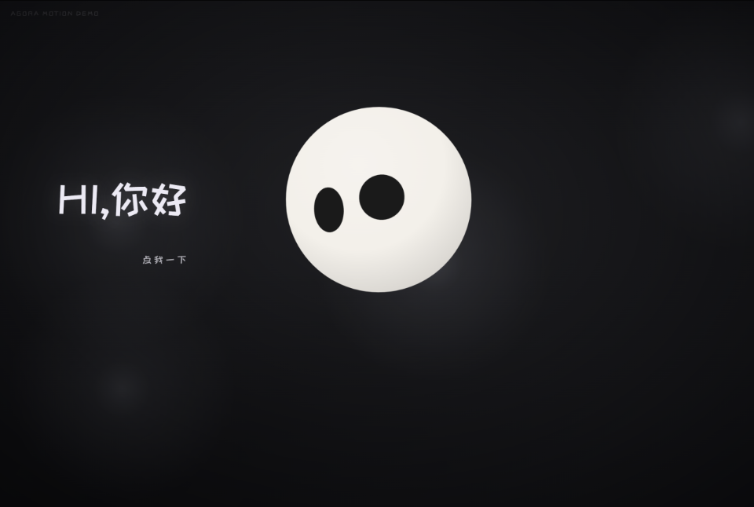
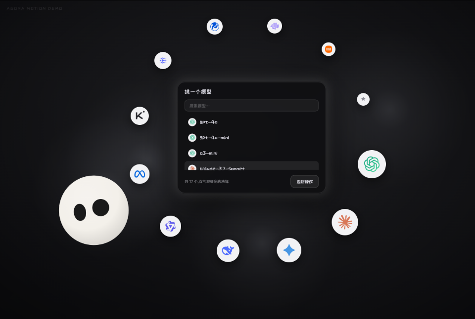

<div align="center">

# Qball

**住在你电脑里的 AI 小助手 —— 一颗会做表情的球 · 一条命令装好 · Key 与数据都在本机**

[](https://github.com/woshi32s/Qball/releases)
[](#安装windows)
[](LICENSE)

[中文](README.md) | [English](README.en.md)

</div>




## 这是什么

Qball 是一个运行在**你自己电脑上**的 AI 小助手:不需要租服务器、不需要注册登录,模型 Key 只保存在本机(`~/.qball`)。

- **一条命令安装**:自动下载安装、配置开机自启、开始菜单随时能打开;`qball uninstall` 一句话卸载
- **点开即用**:浏览器打开就是它 —— 会做表情的小球、开场演出式引导、流式对话、语音朗读(edge-tts)
- **任意 OpenAI 兼容接口**:填入 API 地址 / Key / 模型即可(BYOK),不锁定任何一家
- **本机优先**:对话与配置留在你的电脑里;不依赖任何在线服务(公网部署只是可选项)
- **PWA**:手机、平板、桌面都能「添加到主屏幕」,体验接近原生 App

## 安装(Windows)

### 方式一:一条命令(推荐)

在 PowerShell 里粘贴执行:

```powershell
iwr -useb https://cdn.jsdelivr.net/gh/woshi32s/Qball@main/install.ps1 | iex
```

它会:读取最新版本 → 下载 `Qball.exe` 并校验 → 安装到 `%LOCALAPPDATA%\Qball` → 配置开机自启 → 启动并打开界面。

不想开机自启?用带参数的写法:

```powershell
& ([scriptblock]::Create((iwr -useb https://cdn.jsdelivr.net/gh/woshi32s/Qball@main/install.ps1))) -NoStartup
```

### 方式二:免安装直接跑

到 [Releases](https://github.com/woshi32s/Qball/releases) 下载 `Qball.exe` 双击即可 —— 单文件,自带全部界面资源,不需要 Python。想把它加入 PATH / 开机自启时,再运行一次方式一即可。

> 首次运行 Windows 可能提示「未知发布者」(exe 未签名),点「更多信息 → 仍要运行」即可。

## qball 命令

安装后新开一个终端(PATH 已自动配好):

| 命令 | 说明 |
|---|---|
| `qball start` / `qball stop` | 启动 / 退出 |
| `qball status` / `qball doctor` | 查看运行状态 / 环境体检 |
| `qball logs` | 查看最近日志(`-Tail 50` 看更多) |
| `qball open` | 打开界面 |
| `qball update` | 更新到最新版 |
| `qball autostart on` / `qball autostart off` | 开机自启开关 |
| `qball uninstall` / `qball uninstall -Purge` | 卸载 / 连数据一起卸载 |

## 数据在哪

| 内容 | 位置 |
|---|---|
| 配置 / 日志 / 端口记录 | `%USERPROFILE%\.qball`(config.json、logs、port.txt) |
| 对话记录 | 浏览器的 localStorage(仅本机浏览器) |
| 程序本体 | `%LOCALAPPDATA%\Qball` |

## 常见问题

- **下载慢或失败?** 安装器会自动切换镜像源;仍不行可先开启代理,或手动下载 Release 里的 `Qball.exe` 双击使用。
- **端口被占用?** Qball 会自动在 8600–8610 之间选择空闲端口,并记住上次的选择。
- **重复双击图标?** 检测到已在运行时会直接打开现有页面,不会重复启动。
- **怎么换模型 / 接口?** 页面「设置」里修改(首次打开会有引导),配置只存本机。
- **怎么彻底删除?** `qball uninstall -Purge`,再删掉 `%LOCALAPPDATA%\Qball` 目录即可。

## 从源码运行(开发)

```bash
pip install -r requirements.txt
python server.py          # http://127.0.0.1:8600,自动打开浏览器
```

打包单文件 EXE:

```powershell
pip install pyinstaller
python -m PyInstaller Qball.spec --noconfirm    # 产物:dist\Qball.exe
```

发新版本:更新 `server.py` 里的 `VERSION` → 打 tag(`git tag v0.2.0 && git push --tags`)→ GitHub Actions 自动构建、冒烟测试并发布 Release(同时更新 `version.json`)。

## 部署到公网(可选)

想让朋友点链接就用、自己不用装?见 [DEPLOY.md](DEPLOY.md)(Docker + Caddy 自动 HTTPS)。普通本机使用**不需要**这一步。

## 声明

- **小球形象与表情引擎来源于开源项目 Emotion Ball**(作者 **sam70361**),遵循其「学习交流许可(禁止商业用途)」:
  - 非商业使用:请保留 [LICENSE](LICENSE) 与署名;
  - 商业使用:需事先取得书面授权 —— **1251579308@qq.com**(条款见 [LICENSE-COMMERCIAL.md](LICENSE-COMMERCIAL.md));
  - 原项目在线预览:https://emotion-balls.vercel.app/
- 模型品牌图标:[lobe-icons](https://github.com/lobehub/lobe-icons)(MIT);商标归各自所有者,仅用于识别。
